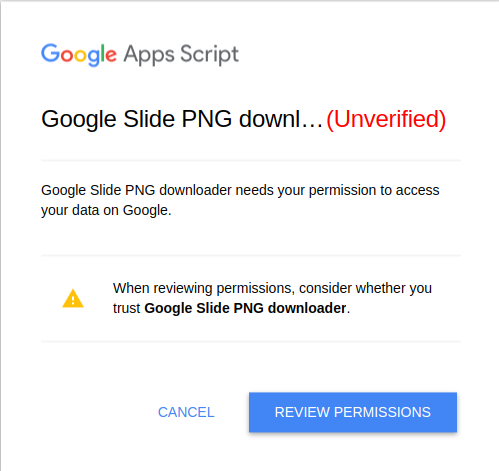
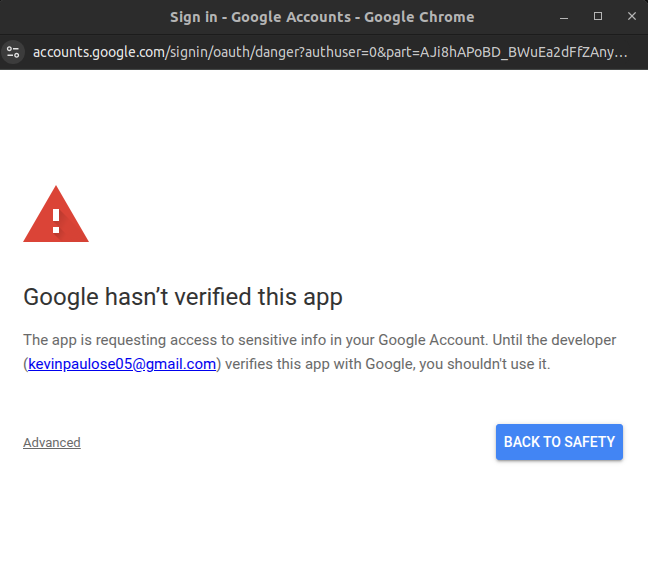
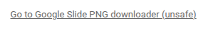

# Slides2PNG

A tool to download an entire Google Slides deck as images and save them directly to your Google Drive.

## Setup Steps:

1. Go to [new script](https://script.new/) to create a new Google Apps Script project.
2. Rename the project to "Google Slide PNG downloader" or any name of your choice by clicking on "Untitled project" in the top left corner.
3. Copy code from `Code.gs` in this repository onto the script's `Code.gs`
4. Create a new file called `Index.html` by clicking on the `+` button besides Files in top left corner. Select HTML in the dropdown.
5. Copy code for `Index.html` from this repository to the app script's `Index.html`
6. You are all set for the script's code section.
7. Now we can deploy this as a web app.
8. Select the blue `Deploy` button on the top-right and select New Deployment.
9. In the top left corner, select the gear icon besides `Select Type` and choose `Web App` from the dropdown.
10. Set the description field as "Google Slide PNG downloader" or any name of your choice.
11. Under Web App's `Execute As` section, choose `User accessing the web app` option. This allows your script to be used by any third person.
12. Under `Who has access` select `Anyone with Google account`.
13. Click `Deploy` and your web app has been deployed.
14. Copy and paste the web app URL you recieved after deploying and open it in your browser.
15. You will see the following prompt:

16. Select `Review Permissions` and choose your Google account to sign in.
17. Now you will see a warning like this-

18. Click `Advanced` and select `Go to Google Slide PNG Downloader (unsafe)`-
    
19. Ignore the warning and this is perfectly safe.
20. All Google to access your slides and drive by clicking `Allow` to authorize google.
21. Now go to the slide you want to download and copy the presentation id, everything between `/d` and /`edit` in your slides' URL. For example, for the URL `https://docs.google.com/presentation/d/ssnsak1j3n2jk2/edit#slide=id.p1`, copy ssnsak1j3n2jk2 and paste this character string into your deployed web app's `Enter a Google Slides link below:` field.
22. Hit `Convert` and you should see a log of your images starting to download.
23. Go to your presentation's drive location and you will find a folder named `PNG Slide Exports` with a sub-folder that has the name of your presentation and all images being downloaded within that subfolder with the name format {`PRESENTATION_NAME}_Slide##.png`.
24. You can change these names by editing relvant parts of the code. It should be easy to find them, just search for the names I have used.
25. You can input links back to back in the tool and all slide decks will be downloaded in their respective sub-folders with the parent `PNG Slide Exports` folder.

### And that's all you need to do to setup this amazing tool!
